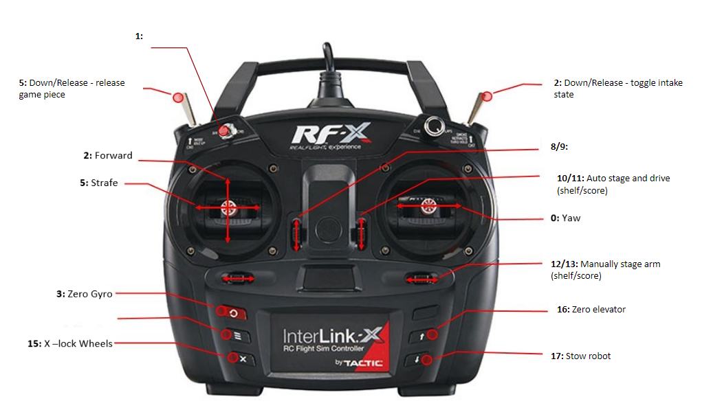
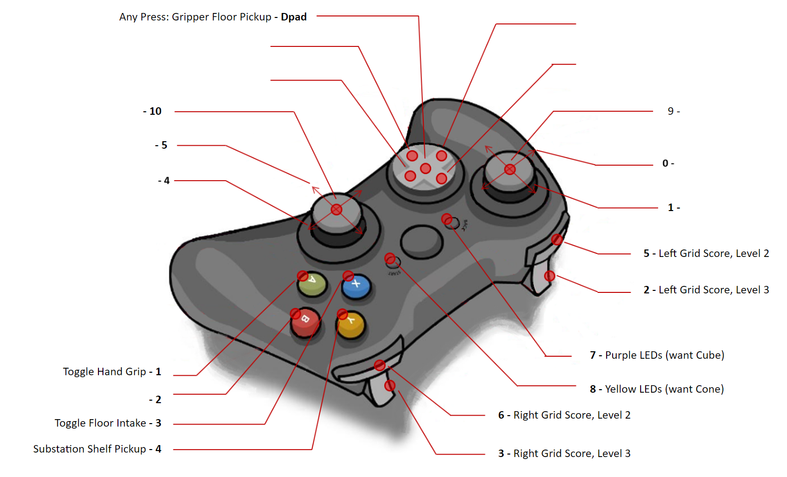

# 2023 FIRST CHARGED UP

## Controls

## CAN Bus

| Subsystem  | Type     | Talon                 | ID | Comp PDP | Proto PDP | Motor      | Breaker |
| ---------- | -------- | --------------------- | -- | -------- | --------- | ---------- | ------- |
| Drive      | SRX      | azimuth               | 0  | 9        |  8        | 9015       |         |
| Drive      | SRX      | azimuth               | 1  | 11       |  12       | 9015       |         |
| Drive      | SRX      | azimuth               | 2  | 8        |  9        | 9015       |         |
| Drive      | SRX      | azimuth               | 3  | 10       |  11       | 9015       |         |
| Drive      | FX       | drive                 | 10 | 0        |  6        | falcon     |         |
| Drive      | FX       | drive                 | 11 | 19       |  15       | falcon     |         |
| Drive      | FX       | drive                 | 12 | 1        |  7        | falcon     |         |
| Drive      | FX       | drive                 | 13 | 18       |  14       | falcon     |         |
| Intake     | FX       | intake rollers        | 20 | 15       |  16       | falcon     |         |
| Intake     | SRX      | extend                | 21 | 12       |  13       | bag        |         |
| Shoulder   | SRX      | left main             | 30 | 3        |  2        | 550        |         |
| Shoulder   | SRX      | right follow          | 34 | 16       | 19        | 550        |         |
| Elevator   | FX       | left main elevator    | 31 | 2        | 5         | falcon     |         |
| Elevator   | FX       | right follow elevator | 32 | 17       | 17        | falcon     |         |
| Elbow      | FX       | left main elbow       | 33 | 5        |  4        | falcon     |         |
| Elbow      | Canifier | canifier              | 15 |  23      |  23       | -          |         |
| Hand       | SRX      | hand                  | 40 |  7       |  3        | 550        |         |
| Hand       | SRX      | rollers               | 41 |  6       |  3        | johnson x2 |         |

* elbow uses remote encoder attached to canifier
* forward limit switch on hand roller is Cone beam break
* reverse limit switch on hand roller is Cube beam break

## Roborio
| Subsystem | Interface | Device | 
| --------- | --------- | ------ |
| Drive     | USB       | NAVX   |

## DIO
| Subsystem | name       | ID |
| --------- | ---------- | -- |
| Auto      | autoSwitch | 0  |
| Auto      | autoSwitch | 1  |
| Auto      | autoSwitch | 2  |
| Auto      | autoSwitch | 3  |
| Auto      | autoSwitch | 4  |
| Auto      | autoSwitch | 5  |
| Vision    | White LEDs | 6  |
| RGB       | RED        | 7  |
| RGB       | Green      | 8  |
| RGB       | Blue       | 9  |

## MXP
| Subsystem | name   | ID |
| --------- | ------ | -- |
| Robot     | BNC    | 0  |

