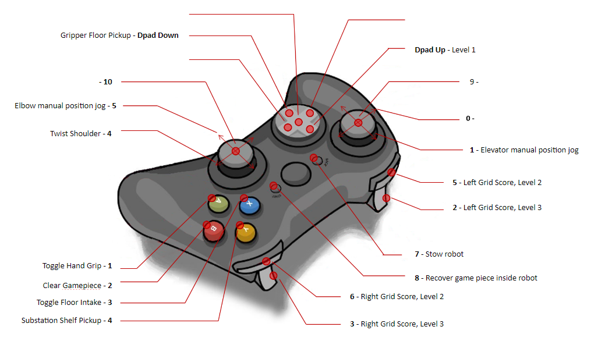

# 2023 FIRST CHARGED UP

## Controls

## CAN Bus

| Subsystem  | Type     | Talon                 | ID | PDP | Motor  | Breaker |
| ---------- | -------- | --------------------- | -- | --- | ------ | ------- |
| Drive      | SRX      | azimuth               | 0  |     | 9015   |         |
| Drive      | SRX      | azimuth               | 1  |     | 9015   |         |
| Drive      | SRX      | azimuth               | 2  |     | 9015   |         |
| Drive      | SRX      | azimuth               | 3  |     | 9015   |         |
| Drive      | FX       | drive                 | 10 |     | falcon |         |
| Drive      | FX       | drive                 | 11 |     | falcon |         |
| Drive      | FX       | drive                 | 12 |     | falcon |         |
| Drive      | FX       | drive                 | 13 |     | falcon |         |
| Intake     | FX       | intake                | 20 |     | falcon |         |
| Intake     | SRX      | extend                | 21 |     | bag x2 |         |
| Shoulder   | SRX      | shoulder              | 30 |     | ??     |         |
| Elevator   | FX       | elevatorLeftMain      | 31 |     | falcon |         |
| Elevator   | FX       | elevatorrightFollower | 32 |     | falcon |         |
| Elbow      | FX       | elbowLeftMain         | 33 |     | falcon |         |
| Elbow      | FX       | elbowRightFollower    | 34 |     | falcon |         |
| Elbow      | Canifier | canifier              | 35 |     | -      |         |
| Hand       | SRX      | hand                  | 40 |     | ??     |         |

* elbow uses remote encoder attached to canifier
* forward limit switch on extend talon = beam break for intake

## Roborio
| Subsystem | Interface | Device | 
| --------- | --------- | ------ |
| Drive     | SPI/MXP   | NAVX   |

## DIO
| Subsystem | name       | ID |
| --------- | ---------- | -- |
| Auto      | autoSwitch | 0  |
| Auto      | autoSwitch | 1  |
| Auto      | autoSwitch | 2  |
| Auto      | autoSwitch | 3  |
| Auto      | autoSwitch | 4  |
| Auto      | autoSwitch | 5  |
| Robot     | BNC        | 6  |
